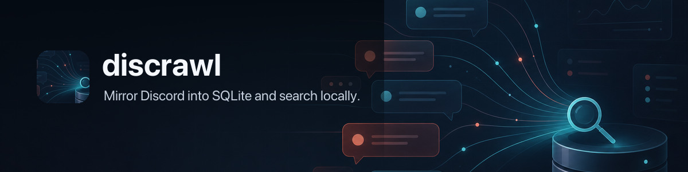

# discrawl 🛰️ — Mirror Discord into SQLite; search server history locally



`discrawl` mirrors Discord guild data into local SQLite so you can search, inspect, and query server history without depending on Discord search. It can also import classifiable Discord Desktop cache messages for local DM recovery/search without using a user token. Teams can publish the guild archive as a private Git snapshot repo, so readers get fresh org memory without Discord bot credentials. Read-only Cloudflare remote archives can be configured without creating a local SQLite database.

There are two local archive sources:

- Discord bot API sync for guilds, channels, members, threads, and message history the configured bot can access
- Discord Desktop cache import for local, classifiable cached messages, including proven local-only DMs under `@me`

Desktop wiretap mode reads local cache artifacts only. It does not extract credentials, use user tokens, call the Discord API as your user, or run a selfbot.

Wiretap DMs stay local and are never exported to the Git-backed snapshot mirror.

## What It Does

- discovers every guild the configured bot can access
- syncs channels, threads, members, and message history into SQLite
- maintains FTS5 search indexes for fast local text search
- builds an offline member directory from archived profile payloads
- extracts small text-like attachments into the local search index
- downloads and backs up cached attachment media when requested
- records structured user and role mentions for direct querying
- tails Gateway events for live updates, with periodic repair syncs
- imports classifiable Discord Desktop cache messages with `wiretap`, including proven DMs under `@me`
- publishes and imports private Git-backed archive snapshots for org-wide read access
- browses stored messages and local DMs in a terminal archive UI
- exposes `metadata --json`, `status --json`, and `doctor --json` for local
  launchers, automation, and CI
- reports Worker-fronted cloud archive status in read-only mode without
  touching local SQLite
- supports Git-only read mode with no Discord credentials on reader machines
- generates backup README activity reports, with optional AI-written field notes
- exposes read-only SQL for ad hoc analysis
- keeps schema multi-guild ready while preserving a simple single-guild default UX

Search defaults to all guilds. `sync` and `tail` default to the configured default guild when one exists, otherwise they fan out to all discovered guilds.

## Requirements

- Go `1.26+`
- for publishing/syncing guilds: a Discord bot token the bot can use to read the target guilds
- for DM wiretap import: local Discord Desktop cache files on the same machine
- for read-only Git-backed access: access to a private snapshot repo, no Discord credentials required
- bot permissions for the channels you want archived when running `sync` or `tail`

### Discord Bot Setup

`discrawl` needs a real bot token. Not a user token.

Minimum practical setup:

1. Create or reuse a Discord application in the Discord developer portal.
2. Add a bot user to that application.
3. Invite the bot to the target guilds.
4. Enable these intents for the bot:
   - `Server Members Intent`
   - `Message Content Intent`
5. Ensure the bot can at least:
   - view channels
   - read message history

Without those intents/permissions, `sync`, `tail`, member snapshots, or message content archiving will be partial or fail.

### Bot Token Sources

Token resolution:

1. `DISCORD_BOT_TOKEN` or the configured `discord.token_env`
2. OS keyring item `discrawl` / `discord_bot_token`, or the configured keyring service/account

`discrawl` accepts either raw token text or a value prefixed with `Bot `. It normalizes that automatically.

Fastest path:

```bash
export DISCORD_BOT_TOKEN="your-bot-token"
discrawl doctor
discrawl init
```

If you keep shell secrets in `~/.profile`, add:

```bash
export DISCORD_BOT_TOKEN="your-bot-token"
```

Then reload your shell before running `discrawl`.

If you prefer the OS keyring, keep the token out of config and store it in the default keyring item:

```bash
# macOS Keychain
security add-generic-password -U -s discrawl -a discord_bot_token -w "$DISCORD_BOT_TOKEN"

# Linux Secret Service / libsecret
printf %s "$DISCORD_BOT_TOKEN" | secret-tool store --label="discrawl Discord bot token" service discrawl username discord_bot_token

# Windows Credential Manager
cmdkey /generic:discrawl:discord_bot_token /user:discord_bot_token /pass:%DISCORD_BOT_TOKEN%
```

Set `discord.token_source = "keyring"` if you want to require keyring lookup instead of env-first fallback.

Default runtime paths follow the OS convention instead of writing a new top-level directory in
your home folder. Linux uses the XDG Base Directory variables. macOS uses `~/Library` folders,
unless you set XDG variables yourself.

- Linux config: `${XDG_CONFIG_HOME:-~/.config}/discrawl/config.toml`
- Linux database/share: `${XDG_DATA_HOME:-~/.local/share}/discrawl/`
- Linux cache: `${XDG_CACHE_HOME:-~/.cache}/discrawl/`
- Linux logs: `${XDG_STATE_HOME:-~/.local/state}/discrawl/logs/`
- macOS config/database/share/logs: `~/Library/Application Support/discrawl/`
- macOS cache: `~/Library/Caches/discrawl/`

Upgrades do not move your database automatically. Existing installs that
already have `~/.discrawl/config.toml` continue to load that config when the
new default config file does not exist. Missing runtime paths also keep using
existing legacy files or directories, such as `~/.discrawl/discrawl.db`, until
the matching new path exists. To migrate deliberately, copy or create the new
config file first, or point Discrawl at it with `--config` / `DISCRAWL_CONFIG`,
then copy the database/share/cache/log paths you want to move.

## Install

Homebrew (recommended):

```bash
brew install openclaw/tap/discrawl
discrawl --version
```

Check for newer releases manually with:

```bash
discrawl check-update
```

Interactive terminal runs also perform a cached daily release check and print a
stderr notice when a newer Discrawl release is available. Set
`DISCRAWL_NO_UPDATE_CHECK=1` or `CRAWLKIT_NO_UPDATE_CHECK=1` to disable that
passive notice.

Build from source:

```bash
git clone https://github.com/openclaw/discrawl.git
cd discrawl
go build -o bin/discrawl ./cmd/discrawl
./bin/discrawl --version
```

Docker:

```bash
docker build -t discrawl .
docker run --rm -e DISCORD_BOT_TOKEN -v "$PWD/.discrawl:/data" discrawl doctor
docker run --rm -e DISCORD_BOT_TOKEN -v "$PWD/.discrawl:/data" discrawl sync
```

The image stores config, SQLite data, cache, and Git snapshot state under `/data`.

Examples below assume `discrawl` is on `PATH`. If you built from source without installing it, replace `discrawl` with `./bin/discrawl`.

## Quick Start

Configure a Discord bot token and refresh both bot-visible guild data and local desktop cache data:

```bash
export DISCORD_BOT_TOKEN="..."
discrawl init
discrawl doctor
discrawl sync --full
discrawl sync
discrawl search "panic: nil pointer"
discrawl tail
```

Use `discrawl sync --source wiretap` when you only want the local Discord Desktop cache import and do not want bot-token API sync.

Git-only reader setup:

```bash
discrawl subscribe https://github.com/example/discord-archive.git
discrawl search "launch checklist"
discrawl messages --channel general --hours 24
```

`init` discovers accessible guilds and writes the default XDG config file. If
exactly one guild is available, that guild becomes the default automatically.
`subscribe` writes a token-free config, imports the private Git snapshot, and
read commands auto-refresh when the local snapshot is older than `15m`.

`doctor` is the fastest sanity check:

- confirms config can be loaded
- shows where the token was resolved from
- verifies bot auth
- shows how many guilds the bot can access
- verifies DB + FTS wiring

## Commands

### `tui`

Opens the local terminal archive browser for stored messages.

```bash
discrawl tui
discrawl tui --guild 123456789012345678 --channel general
discrawl tui --dm
discrawl --json tui --limit 50
```

The terminal browser uses the shared crawlkit explorer. The left pane groups
channels, people, or threads; the middle pane lists messages; the right pane
shows the selected message, surrounding conversation, and thread detail. Mouse
selection, right-click actions, sortable headers, and the local/remote footer
follow the same interaction model as `gitcrawl tui`. See
[`docs/commands/tui.md`](docs/commands/tui.md) for flags and read-only/DM scope
notes.

### `init`

Creates the local config and discovers accessible guilds.

```bash
discrawl init
discrawl init --guild 123456789012345678
discrawl init --db ~/data/discrawl.db
```

### `sync`

Refreshes SQLite from one or both archive sources.

By default, `sync` runs both live/local sources and does not import the Git snapshot first:

- Discord bot-token sync for bot-visible guild data
- local Discord Desktop cache import for classifiable cached messages and proven DMs

Use `discrawl update` when you want to pull/import the shared Git snapshot. If you intentionally want a sync run to import the snapshot before live deltas, pass `--update=auto` to import only when stale or `--update=force` to pull/import before syncing. `--no-update` is accepted as an explicit no-op alias for the default.

Run one explicit `--full` pass when you want a complete historical guild archive. Use plain `sync` afterward for frequent latest-message and desktop-cache refreshes.

```bash
discrawl sync
discrawl sync --update=auto
discrawl sync --update=force
discrawl sync --no-update
discrawl sync --full
discrawl sync --full --all
discrawl sync --guild 123456789012345678
discrawl sync --guilds 123,456 --concurrency 8
discrawl sync --source both      # default: bot API + desktop cache
discrawl sync --source discord   # bot API only; aliases: key, bot, api
discrawl sync --source wiretap   # desktop cache only; aliases: desktop, cache
discrawl sync --guild 123456789012345678 --all-channels
discrawl sync --channels 111,222 --since 2026-03-01T00:00:00Z
```

Sync sources:

| Source | Reads from | Stores |
| --- | --- | --- |
| `both` | Discord bot API and local Discord Desktop cache | bot-visible guild data plus classifiable cached desktop messages |
| `discord` / `key` | Discord bot API | guilds, channels, threads, members, and messages the bot can access |
| `wiretap` | local Discord Desktop cache files | classifiable cached messages; proven DMs are stored under `@me` |

Sync modes control the Discord bot API side of a run. When `wiretap` is selected, the desktop cache import runs once alongside the chosen bot sync mode.

Bot sync modes:

| Command | Use when | Behavior |
| --- | --- | --- |
| `discrawl sync` | routine refresh | skips member refreshes, checks live top-level channels plus active threads, and only fetches new messages for channels with a stored latest cursor |
| `discrawl sync --update=auto` | hybrid Git/live refresh | imports a stale Git snapshot first, then runs the routine live refresh |
| `discrawl sync --all-channels` | repair pass | broad incremental sweep across every stored channel/thread, including archived threads |
| `discrawl sync --full` | historical backfill | crawls older history until channels are complete; can take a long time on large servers |

`sync` already uses parallel channel workers for bot API message crawling.
`--concurrency` overrides the default, and the default is auto-sized from `GOMAXPROCS` with a floor of `8` and a cap of `32`.
`--all` ignores `default_guild_id` and fans out across every discovered guild the bot can access.
`--skip-members` refreshes guild/channel/message data without crawling the full member list, which is useful for frequent Git snapshot publishers that only need latest messages.
`--latest-only` is still accepted for explicit latest-only runs; it is now the default for untargeted `sync`. Use `--all-channels` to opt out of the fast default without doing a full historical crawl.
`--with-media` downloads missing attachment media into `cache_dir/media` after the message sync/import phase. Discord attachment URLs can expire or disappear; those downloads are marked `failed` with the HTTP status, usually `404`, while successfully fetched files remain cached and can still be published.
When `--channels` includes a forum channel id, `discrawl` expands that forum's threads and syncs their messages as part of the targeted run.
`--since` limits initial history/bootstrap and full-history backfill to messages at or after the given RFC3339 timestamp. It does not mark older history as complete, so a later `sync --full` without `--since` can continue the backfill.
Long runs now emit periodic progress logs to stderr so large backfills and Git snapshot imports do not look hung.
If in-flight channels stop completing for a while, `discrawl` now emits `message sync waiting` heartbeat logs with the oldest active channel, per-channel page activity, and skip/defer counters, and every run ends with a `message sync finished` summary.
Each channel crawl also has a bounded runtime budget, so a pathological channel is deferred and retried on the next sync instead of pinning a worker forever.
Retryable failures and unavailable-channel markers are tracked per channel; stale unavailable markers are cleared after a later successful crawl, and marker cleanup is best-effort so one missing local sync-state row cannot crash the run.
Full sync member refresh is best-effort and currently gives up after five minutes without a caller-supplied deadline, so message sync completion is not held hostage by a slow guild member crawl.
When the archive is already complete, `sync --full` now reuses the stored backlog markers and limits steady-state refresh to live top-level channels plus active threads instead of revisiting every stored archived thread.
If a guild already has a local member snapshot, routine syncs reuse it and skip another full member crawl until that snapshot ages out.

### `tail`

Runs the live Gateway tail and periodic repair loop.

```bash
discrawl tail
discrawl tail --guild 123456789012345678
discrawl tail --repair-every 30m
```

### `wiretap`

Imports classifiable Discord Desktop message payloads into the same local SQLite archive.

This is the path for searchable DMs because bot tokens cannot read personal direct messages.

`wiretap` is also available through `discrawl sync --source wiretap` and is included in the default `discrawl sync --source both` path.

```bash
discrawl wiretap
discrawl wiretap --path "$HOME/Library/Application Support/discord"
discrawl wiretap --dry-run
discrawl wiretap --full-cache
discrawl wiretap --watch-every 2m
```

Notes:

- stores classifiable cache messages in the same `guilds`, `channels`, and `messages` tables used by bot sync
- stores proven DMs under the synthetic guild id `@me`
- keeps `@me` rows local-only: `publish`, Git snapshot import/export, and optional embedding snapshot export exclude DM guilds, channels, messages, events, attachments, mentions, wiretap sync state, and vectors for DM messages
- preserves existing local `@me` guilds, channels, messages, and attachments when importing a Git snapshot, so a shared guild mirror refresh does not wipe local wiretap DM search
- drops message payloads whose channel cannot be classified from cached channel metadata or Discord route URLs; dropped rows are counted as `skipped_messages`
- imports what Discord Desktop has cached locally, not complete live DM history
- scans local `.ldb`, `.log`, `.json`, and `.txt` artifacts for Discord message JSON, plus route-bearing Chromium HTTP cache entries by default
- use `--full-cache` or `desktop.full_cache = true` for exhaustive Chromium cache import when you want slower historical guild-cache archaeology
- does not extract, store, or print Discord auth tokens
- `--max-file-bytes` skips unusually large files; default is 64 MiB

### `search`

Searches archived messages. FTS is the default mode and works without embeddings.

```bash
discrawl search "panic: nil pointer"
discrawl search --mode fts "panic: nil pointer"
discrawl search --mode semantic "missing launch checklist"
discrawl search --mode hybrid "database timeout"
discrawl search --guild 123456789012345678 "payment failed"
discrawl search --dm "launch checklist"
discrawl search --channel billing --author steipete --limit 50 "invoice"
discrawl search --include-empty "GitHub"
discrawl --json search "websocket closed"
```

By default, `search` skips rows with no searchable content. Attachment text, attachment filenames, embeds, and replies still count as content. Use `--include-empty` to opt back in.

Modes:

- `fts` searches the local FTS index and returns the newest matching messages first.
- `semantic` embeds the query, searches locally stored message vectors, and returns a clear error if embeddings are disabled or no compatible vectors exist.
- `hybrid` runs FTS and semantic search, deduplicates by message id, and falls back to FTS when semantic search is unavailable.

FTS uses SQLite FTS5 with the default `unicode61` tokenizer. User query terms are parameterized and quoted before `MATCH`, so tokens like `AND`, `OR`, `NOT`, `NEAR`, and `*` are searched as input terms instead of FTS operators. Punctuation still follows FTS5 tokenization rules.

Semantic and hybrid search require `[search.embeddings]` plus local `message_embeddings` rows for the configured provider, model, and input version. Run `discrawl sync --with-embeddings` to enqueue changed messages, then `discrawl embed` to generate vectors. The input version is currently `message_normalized_v1`, so vectors are tied to normalized message text rather than raw Discord payloads.

### `messages`

Lists exact message slices by channel, author, and time range.

```bash
discrawl messages --channel maintainers --days 7 --all
discrawl messages --channel maintainers --hours 6 --all
discrawl messages --channel "#maintainers" --since 2026-03-01T00:00:00Z
discrawl messages --channel 1456744319972282449 --author steipete --limit 50
discrawl messages --channel maintainers --last 100 --sync
discrawl messages --dm --channel Molty --last 20
discrawl messages --channel maintainers --days 7 --all --include-empty
discrawl --json messages --channel maintainers --days 3
```

Notes:

- `--channel` accepts a channel id, exact name, `#name`, or partial name match
- `--hours` is shorthand for "since now minus N hours"
- `--days` is shorthand for "since now minus N days"
- `--last` returns the newest `N` matching messages, then prints them oldest-to-newest
- `--all` removes the safety limit; default is `200`
- `--sync` runs a blocking pre-query sync for the matching channel or guild scope before reading the local DB; omit it while `tail` is already maintaining live freshness
- rows with no displayable/searchable content are skipped by default; `--include-empty` opts back in
- at least one filter is required
- `--dm` is shorthand for `--guild @me`, so DM searches and message slices do not need raw SQL

### `attachments`

Lists attachment metadata and downloads media into the local cache when requested.

```bash
discrawl attachments --channel general --days 7
discrawl attachments --filename crash --type image --all
discrawl attachments fetch --channel general --days 7
discrawl attachments fetch --missing --max-bytes 104857600
```

Media bytes are stored under `cache_dir/media`, not in SQLite. SQLite stores attachment metadata, content hash, relative media path, fetch status, and fetch error. `attachments fetch` and `sync --with-media` only populate the local cache; run `publish --push` afterward to copy cached non-DM media into the Git backup. Cached non-DM media is included in Git snapshots by default; `publish --no-media` omits it.

### `dms`

Lists local wiretap DM conversations or reads one DM thread.

```bash
discrawl dms
discrawl dms --with Molty --last 20
discrawl dms --with 1456464433768300635 --all
discrawl dms --search "launch checklist"
discrawl dms --with Molty --search "invoice"
```

`discrawl dms` shows one row per local DM channel with message count, author count, and first/last cached message times. Passing `--with` switches to message output for that DM conversation unless `--list` is also set. `--search` searches only local DM messages. This is a convenience layer over the local-only synthetic guild id `@me`; it skips Git snapshot auto-update because DMs are never imported from the shared mirror, and it still only sees Discord Desktop cache data imported by `wiretap`.

### `mentions`

Lists structured user and role mentions.

```bash
discrawl mentions --channel maintainers --days 7
discrawl mentions --target steipete --type user --limit 50
discrawl mentions --target 1456406468898197625
discrawl --json mentions --type role --days 1
```

Notes:

- `--target` accepts an id, exact name, or partial name match
- `--type` can be `user` or `role`
- same guild/time filters as `messages`

### `sql`

Runs read-only SQL against the local database.

```bash
discrawl sql 'select count(*) as messages from messages'
echo 'select guild_id, count(*) from messages group by guild_id' | discrawl sql -
```

### `members`

```bash
discrawl members list
discrawl members show 123456789012345678
discrawl members show --messages 10 steipete
discrawl members search "peter"
discrawl members search "github"
discrawl members search "https://github.com/steipete"
```

Notes:

- `search` matches names plus any offline profile fields present in the archived member payload
- `show` accepts a user id or query; if it resolves to one member, it also shows recent messages
- extracted profile fields may include `bio`, `pronouns`, `location`, `website`, `x`, `github`, and discovered URLs
- if the bot cannot see a field from Discord, `discrawl` cannot invent it; this is strictly archive-based offline data

Typical workflow:

```bash
discrawl sync --full
discrawl members search "design engineer"
discrawl members search "github"
discrawl members show --messages 25 steipete
discrawl messages --author steipete --days 30 --all
```

Typical `members show` output:

```text
guild=1456350064065904867
user=37658261826043904
username=steipete
display=Peter Steinberger
joined=2026-03-08T16:03:14Z
bot=false
x=steipete
github=steipete
website=https://steipete.me
bio=Builds native apps and tooling.
urls=https://steipete.me, https://github.com/steipete
message_count=1284
first_message=2026-02-01T09:00:00Z
last_message=2026-03-08T15:59:58Z
```

Searchable member data comes from:

- Discord member/user payload fields archived into `members.raw_json`
- explicit profile fields when Discord exposes them
- URLs and social handles inferred from archived profile text
- current member snapshot data such as names, nick, roles, and join time

### `channels`

```bash
discrawl channels list
discrawl channels show 123456789012345678
```

### `status`

Shows local archive status.

```bash
discrawl status
```

### Git-backed sharing

`discrawl` can publish the SQLite archive as sharded, compressed NDJSON snapshots in a private Git repo, then auto-import that repo before local read commands.

Publisher:

```bash
discrawl publish --remote https://github.com/example/discord-archive.git --push
discrawl publish --tag backup-2026-06-19 --push
discrawl publish --readme path/to/discord-backup/README.md --push
discrawl publish --public-only --include-channels 1458141495701012561 --push
discrawl publish --no-media --push
```

Subscriber:

```bash
discrawl subscribe https://github.com/example/discord-archive.git
discrawl search "launch checklist"
discrawl messages --channel general --hours 24
discrawl update --ref backup-2026-06-19
```

`subscribe` is the Git-only setup path. It writes a config with `discord.token_source = "none"`, imports the snapshot, and does not require a Discord bot token. `sync` and `tail` remain disabled in this mode because they need live Discord access.

Cloud remote subscribers can use a Worker-fronted archive without a local
SQLite import:

```bash
discrawl subscribe-cloud --endpoint https://crawl.example.workers.dev --archive openclaw/discord
discrawl remote login --endpoint https://crawl.example.workers.dev --json
discrawl status --json
discrawl search "release notes" --json
discrawl messages --channel 1458141495701012561 --json
discrawl remote archives
discrawl whoami
```

`subscribe-cloud` writes `[remote]` config and sets `discord.token_source =
"none"`. It does not clone a Git repo, import a snapshot, or create the local
SQLite database.
The remote service is deployed separately from discrawl in `openclaw/crawl-remote`
with Wrangler. discrawl only stores the Worker endpoint/archive in config and
calls that service.
`remote login` starts the Worker GitHub OAuth flow, verifies org/team
membership server-side, and stores the signed bearer token in the OS keyring.
Use `remote login --github-token-env GITHUB_TOKEN` for non-browser bootstrap;
the Worker verifies that GitHub token against the same org/team policy and
stores only the returned remote session token locally.

Publishers can send the current non-DM SQLite archive into the Worker-backed
D1 archive:

```bash
discrawl cloud publish --remote https://crawl.example.workers.dev --archive openclaw/discord
```

`cloud publish` excludes `@me`/DM rows and leaves existing Git-backed
`publish`, `subscribe`, and `update` behavior unchanged.

Configure freshness:

```bash
discrawl subscribe --stale-after 15m https://github.com/example/discord-archive.git
discrawl subscribe --no-auto-update https://github.com/example/discord-archive.git
```

Once `share.remote` is configured, read commands auto-fetch and import when the local share import is older than `share.stale_after` (default `15m`). Imports are planned from crawlkit shard fingerprints, with a Git-object fallback for older manifests, so routine updates normally read only changed tail shards and preserve local FTS rows instead of rebuilding the whole archive. `discrawl update` forces the same pull/import step manually; `update --ref <tag-or-commit>` restores that historical snapshot without moving the share checkout. `discrawl sync` does not auto-import the share unless `--update=auto` or `--update=force` is provided, so routine live refreshes stay fast.

Hybrid mode is supported too: keep normal Discord credentials configured and set `share.remote`. `discrawl sync --update=auto` and `discrawl messages --sync` import the Git snapshot first, usually as a changed-shard delta, then use live Discord for latest-message deltas. Use `sync --all-channels` or `sync --full` when you intentionally want a broader live repair/backfill pass.

Git snapshots publish non-DM archive tables and cached non-DM attachment media by default. Cached media is written as gzip-compressed files under `media/` and restored to raw local cache files on import. Older snapshots that contain raw media files still import, and the next media-enabled `publish` rewrites the media tree into gzip form. DMs, desktop wiretap rows, DM media, and local secrets are never exported. Use `publish --no-media` to omit cached media files.
Subscribers can use `subscribe --no-media` or `update --no-media` to import only SQLite rows and skip restoring cached files.

Media backup is a two-step publisher workflow: first fetch bytes with `discrawl sync --with-media` or `discrawl attachments fetch`, then publish with `discrawl publish --push`. Scheduled publishers that should include media can set `sync.attachment_media = true` and leave `share.media = true`, which is the default. `publish` never downloads missing Discord files by itself; it exports only media already present in the local cache.

Publish filters narrow only the Git snapshot. The publisher can still sync and
keep a richer local SQLite archive, then publish a smaller view for Git-only
readers:

```bash
discrawl publish --public-only --push
discrawl publish --include-channels 1458141495701012561 --push
discrawl publish --public-only --include-channels 1458141495701012561 --push
discrawl publish --exclude-channels 123456789012345678 --push
```

- `--public-only` keeps channels visible to the guild `@everyone` role after
  category and channel permission overwrites. Private threads are excluded.
- `--include-channels` exports only the listed channel ids. Including a forum
  parent also includes its allowed public threads.
- `--exclude-channels` omits listed channel ids and wins over includes.
- Combining filters intersects them: `--public-only --include-channels A,B`
  exports only included channels that are also public.

The same defaults can live in config:

```toml
[share.filter]
public_only = true
include_channel_ids = ["1458141495701012561"]
exclude_channel_ids = []
```

Filtered publishes also filter channel-scoped sync state, referenced member
rows, attachments, mentions, events, and exported embedding vectors. They do
not export share manifest state or guild-level member freshness markers, because
those would describe the full archive rather than the filtered snapshot.

Filtered publishes cannot use `--readme`, because report totals are computed
from the full local archive. If a previous unfiltered publish committed a
generated Discrawl `README.md` to the share repo, the next filtered publish
removes that generated README before committing so stale full-archive totals are
not carried forward. Custom README files without the Discrawl report markers are
left alone.

Embedding queue state stays local to each machine, and Git-only readers can use
FTS immediately without an embedding provider.

Generated vectors can be backed up explicitly:

```bash
discrawl publish --with-embeddings --push
discrawl subscribe --with-embeddings https://github.com/example/discord-archive.git
discrawl update --with-embeddings
```

`--with-embeddings` exports stored `message_embeddings` rows for the configured `[search.embeddings]` provider/model plus the current input version. The snapshot stores those vectors under `embeddings/<provider>/<model>/<input_version>/...` and records that identity in `manifest.json`. Only vectors for exported non-DM messages are included, so publish filters also filter embeddings. Import only restores matching embedding manifests, so an Ollama/nomic subscriber does not accidentally import OpenAI/text-embedding vectors into semantic search. `embedding_jobs` is never exported; subscribers that want fresh local vectors can run `discrawl embed --rebuild` to create their own queue and vectors. Publishing without `--with-embeddings` omits embedding manifests instead of carrying forward an older bundle.

The Docker smoke test installs `discrawl` in a clean Go container, subscribes to a Git snapshot repo, then checks `search`, `messages`, `sql`, and `report`:

```bash
DISCRAWL_DOCKER_TEST=1 go test ./internal/cli -run TestDockerGitSourceSmoke -count=1
```

### `report`

Generates the Markdown activity block used by the shared backup repo README.

```bash
discrawl report
discrawl report --readme path/to/discord-backup/README.md
```

Unfiltered scheduled snapshot publishes can update deterministic README stats:
latest update time, latest archived message, archive totals, and day/week/month
activity. Filtered publishes skip generated README reports to avoid leaking
full-archive totals.

The backup workflows restore and save `.discrawl-ci/discrawl.db` with `actions/cache`. On a warm runner cache, scheduled publishers skip the pre-sync snapshot import and go straight to the live latest-message delta before publishing. Cache misses still import the latest published snapshot first so `--latest-only` has channel cursors to resume from. The Discord backup publisher also runs a daily `--with-members` sync so archived member roles and profiles stay current without slowing every 15-minute message delta. That explicit member refresh fails the run if Discord rejects or times out the member crawl, rather than publishing a silently stale role snapshot.

### `digest`

Summarizes per-channel activity for a lookback window.

```bash
discrawl digest
discrawl digest --since 30d
discrawl digest --guild 123456789012345678
discrawl digest --channel general
discrawl --json digest --since 7d --top-n 5
```

Notes:

- `--since` accepts Go durations (`72h`, `30m`) and `Nd` shorthand (`7d`, `30d`)
- `--guild` scopes to one guild; when omitted, `default_guild_id` is used if configured
- `--channel` accepts a channel id or exact channel name
- `--top-n` controls how many top posters and mention targets are shown per channel

### `analytics`

Groups activity-style queries under one namespace.

```bash
discrawl analytics
discrawl analytics quiet --since 30d
discrawl analytics quiet --guild 123456789012345678
discrawl analytics trends --weeks 8
discrawl analytics trends --weeks 12 --channel general
discrawl --json analytics quiet --since 60d
discrawl --json analytics trends --weeks 4
```

Notes:

- `analytics quiet` shows top-level text/announcement channels with no messages in the lookback window, including never-active channels
- `analytics quiet --guild` scopes the report to one guild; when omitted, `default_guild_id` is used if configured
- `analytics trends` shows Monday-start UTC weekly message counts per message-capable channel
- `analytics trends --channel` accepts a channel id or exact channel name

### `doctor`

Checks config, auth, DB, and FTS wiring.

```bash
discrawl doctor
```

## Configuration

`init` writes a complete config, so most users should not hand-edit anything initially.

Typical config shape:

```toml
version = 1
default_guild_id = ""
guild_ids = []
db_path = "~/.local/share/discrawl/discrawl.db" # macOS: "~/Library/Application Support/discrawl/discrawl.db"
cache_dir = "~/.cache/discrawl" # macOS: "~/Library/Caches/discrawl"
log_dir = "~/.local/state/discrawl/logs" # macOS: "~/Library/Application Support/discrawl/logs"

[discord]
token_source = "env" # use "none" for Git-only read access
token_env = "DISCORD_BOT_TOKEN"
token_keyring_service = "discrawl"
token_keyring_account = "discord_bot_token"

[sync]
source = "both" # use "discord" for bot-only sync or "wiretap" for desktop-cache-only import
concurrency = 16
repair_every = "6h"
full_history = true
attachment_text = true
attachment_media = false
max_attachment_bytes = 104857600

[desktop]
path = "~/.config/discord" # macOS default: "~/Library/Application Support/discord"
max_file_bytes = 67108864
full_cache = false

[search]
default_mode = "fts"

[search.embeddings]
enabled = false
provider = "openai"
model = "text-embedding-3-small"
api_key_env = "OPENAI_API_KEY"
batch_size = 64

[share]
remote = ""
repo_path = "~/.local/share/discrawl/share" # macOS: "~/Library/Application Support/discrawl/share"
branch = "main"
auto_update = true
stale_after = "15m"
media = true

[remote]
mode = "local" # use "cloud" for Worker-fronted remote archives
endpoint = ""
archive = ""
token_env = "DISCRAWL_REMOTE_TOKEN"
stale_after = ""
```

The value above is an example. `init` writes an auto-sized default based on the host: `min(32, max(8, GOMAXPROCS*2))`.

Config override rules:

- `--config` beats everything
- `DISCRAWL_CONFIG` overrides the default config path
- `discord.token_source = "none"` disables live Discord access for Git-only readers
- `discord.token_source = "keyring"` skips env lookup and reads only the configured OS keyring item
- `remote.mode = "cloud"` makes `status --json` and `remote ...` read the configured Worker archive without opening SQLite
- `DISCRAWL_NO_AUTO_UPDATE=1` disables Git snapshot auto-update for read commands in one process, useful for report jobs that already imported a fresh backup.

## Embeddings

Embeddings are optional. FTS is the default search path and the primary verification target.

If enabled, embeddings are intended to enrich recall in background batches, not block the hot sync path.

```bash
export OPENAI_API_KEY="..."
discrawl init --with-embeddings
discrawl sync --with-embeddings
discrawl embed --limit 1000
discrawl search --mode semantic "launch checklist"
discrawl search --mode hybrid "launch checklist"
```

Embedding creation has two phases:

1. `sync --with-embeddings` queues changed messages by writing `embedding_jobs` rows. New messages, changed normalized text, and messages that do not already have a job are queued. This phase does not call the embedding provider.
2. `discrawl embed` drains pending jobs in bounded batches, calls the configured provider, and writes vectors to `message_embeddings` with provider, model, input version, dimensions, and binary vector data.

During drain, `discrawl` claims jobs with a short lock so overlapping runs do not process the same batch. Rate limits requeue the batch and stop that drain run cleanly. Provider or validation failures retry up to three attempts before the job is marked failed. Messages with no normalized text are marked done and any stale vector for that message is removed.

The provider/model/input-version identity is stored on each job and vector. If you change provider or model, pending jobs are retargeted to the new identity and prior attempts are reset. Existing vectors for another identity remain in SQLite, but semantic search only reads vectors compatible with the current config.

Use `--rebuild` when changing provider, model, or input settings and you want to regenerate vectors for the existing archive:

```bash
discrawl embed --rebuild --limit 1000
```

Local providers can keep message and query embedding on the same machine:

```toml
[search.embeddings]
enabled = true
provider = "ollama"
model = "nomic-embed-text"
vector_backend = "exact"
```

Set `vector_backend = "turbovec"` to use the optional crawlkit turbovec bridge for semantic scoring. It requires Python plus the `turbovec` package, and embedding dimensions must be divisible by 8. With remote providers, message text is sent during `discrawl embed`, and search query text is sent when using `--mode semantic` or `--mode hybrid`. Stored message text is not sent during local vector scoring.

## Data Stored Locally

- guild metadata
- channels and threads in one table
- current member snapshot
- canonical message rows
- append-only message event records
- FTS index rows
- optional local embedding queue metadata and vectors

Messages imported from Discord Desktop use the same message, attachment, mention, and FTS paths as bot-synced messages.

Proven DMs use `@me` as their guild id. Unclassifiable desktop-cache payloads are skipped instead of being stored as unknown synthetic data.

SQLite schema migrations are versioned with `PRAGMA user_version`. Startup now fails fast when a local DB schema is newer than the supported binary.

Attachment binaries are not stored in SQLite. `attachments fetch` and `sync --with-media` write media bytes under `cache_dir/media`; SQLite stores the relative media path, content hash, size, fetch status, and fetch error. Discord CDN `404` responses mean the remote object is no longer fetchable, not that local storage or Git snapshot export failed.

Set `sync.attachment_text = false` if you want to keep attachment metadata and filenames but disable attachment body fetches for text indexing.

## Security

- do not commit bot tokens or API keys
- default config lives in your home directory, not inside the repo
- prefer env vars or the OS keyring for bot tokens
- CI runs secret scanning with `gitleaks`
- `doctor` reports token source, not token contents

## Development

Local gate:

```bash
go run github.com/golangci/golangci-lint/v2/cmd/golangci-lint@v2.11.1 run
go test ./... -coverprofile=/tmp/discrawl.cover
go tool cover -func=/tmp/discrawl.cover | tail -n 1
go build ./cmd/discrawl
go run ./cmd/discrawl help | grep tui
```

Target coverage is `>= 85%`.

CI runs:

- `golangci-lint`
- `go test` with coverage threshold enforcement
- `go build ./cmd/discrawl`
- `gitleaks` against git history and the working tree

## Notes

- the schema is multi-guild ready even when the common UX stays single-guild simple
- threads are stored as channels because that matches the Discord model
- archived threads are part of the sync surface
- live sync is resumable; large guilds still take time because Discord rate limits history backfill

## License

MIT. See [LICENSE](LICENSE).
